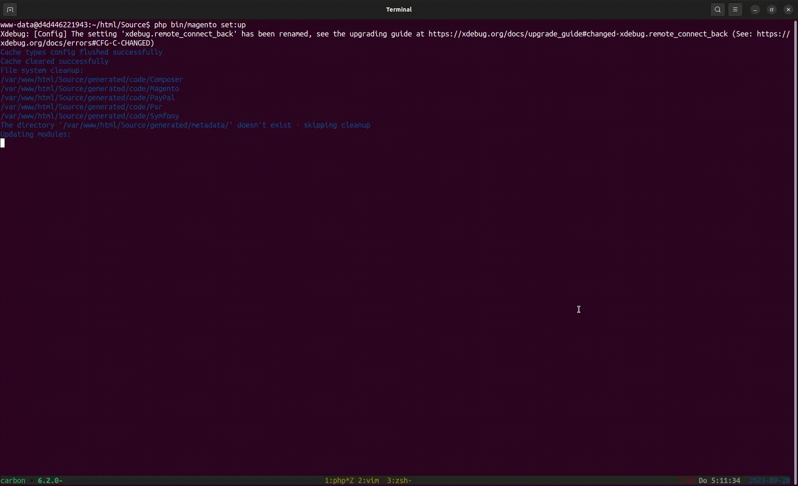

# Fancy CLI

This is an experiment to implement a progressbar into CLI taks `bin/magento setup:upgrade`.

It replaces the `ConsoleLogger` with a custom `ProgressbarLogger`.

There is some core patch required to make this work. See the result here:

